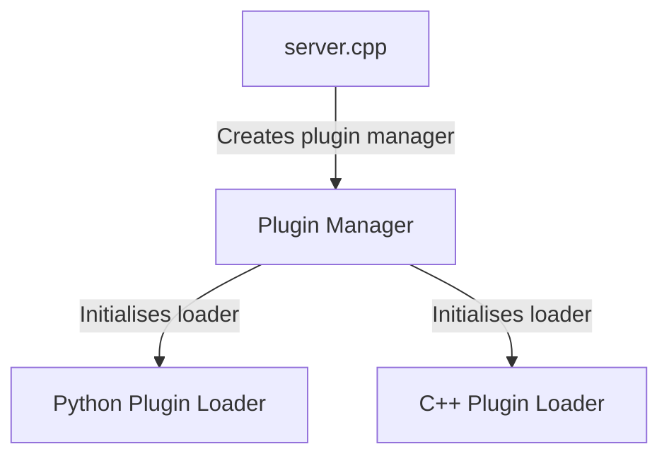
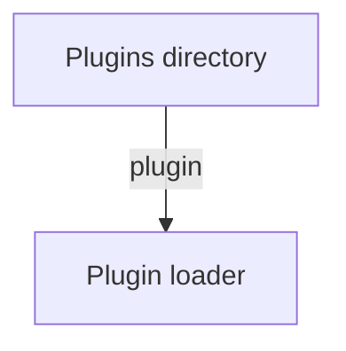

# Plugins Deep Dive

How does Endstone load your plugins?

Firstly, `server.cpp` makes the plugin manager. Then, the "plugins" directory is scanned.

```cpp
auto plugin_dir = fs::current_path() / "plugins";
```



The plugin manager (`EndstonePluginManager`) creates loaders

> [!note] Resolver
> 

```cpp
Plugin *EndstonePluginManager::loadPlugin(std::string file)
{
    auto *loader = resolvePluginLoader(file);
    if (!loader) {
        return nullptr;
    }
    auto *plugin = loader->loadPlugin(file);
    if (!plugin) {
        return nullptr;
    }
    initPlugin(*plugin, *loader, fs::path(file).parent_path());  // dependency injection
    if (!loadPlugin(*plugin)) {
        return nullptr;
    }
    return plugin;
}
```

Plugin loaders define what file they accept



```cpp
void EndstoneServer::loadPlugins()
{
    plugin_manager_->registerLoader(std::make_unique<CppPluginLoader>(*this));
    plugin_manager_->registerLoader(std::make_unique<PythonPluginLoader>(*this));

    auto plugin_dir = fs::current_path() / "plugins";

    if (exists(plugin_dir)) {
        plugin_manager_->loadPlugins(plugin_dir.string());
    }
    else {
        create_directories(plugin_dir);
    }
}
```


```cpp
std::vector<Plugin *> EndstonePluginManager::loadPlugins(std::vector<std::string> files)
{
    std::vector<Plugin *> plugins;
    for (const auto &file : files) {
        auto *loader = resolvePluginLoader(file);
        if (!loader) {
            continue;
        }
        auto *plugin = loader->loadPlugin(file);
        if (!plugin) {
            continue;
        }
        initPlugin(*plugin, *loader, fs::path(file).parent_path());  // dependency injection
        plugins.push_back(plugin);
    }
    return loadPlugins(plugins);
}
```


```cpp
namespace endstone {

/**
 * @brief Called when an Actor is spawned into a world.
 *
 * If an Actor Spawn event is cancelled, the actor will not spawn.
 */
class ActorSpawnEvent : public Cancellable<ActorEvent<Actor>> {
public:
    explicit ActorSpawnEvent(Actor &actor) : Cancellable(actor) {}
    ~ActorSpawnEvent() override = default;

    inline static const std::string NAME = "ActorSpawnEvent";
    [[nodiscard]] std::string getEventName() const override { return NAME; }

    // TODO(event): add spawn cause
};

}  // namespace endstone
```

**EVENTS ARE IMPORTANT!!!**

`callEvent(e)`